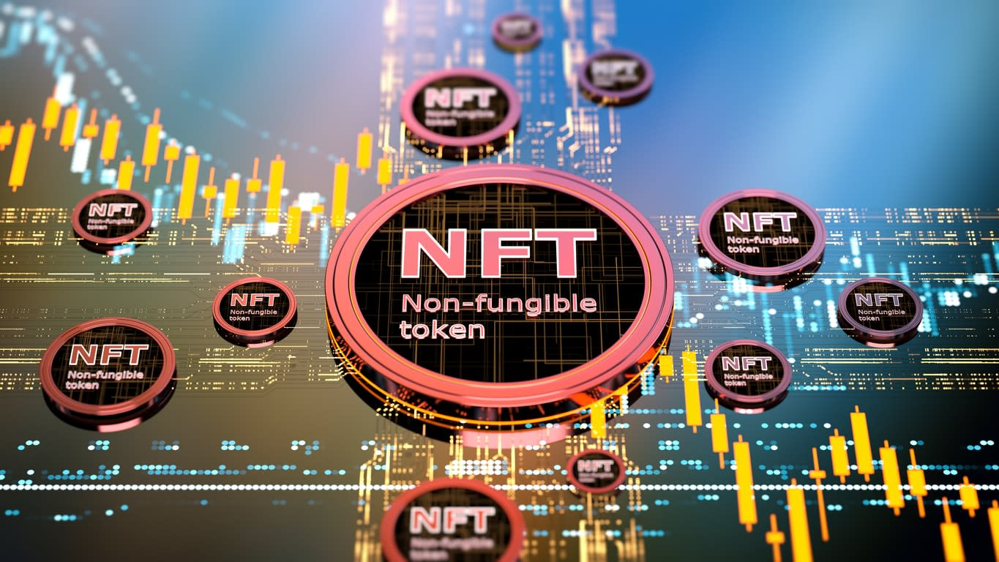
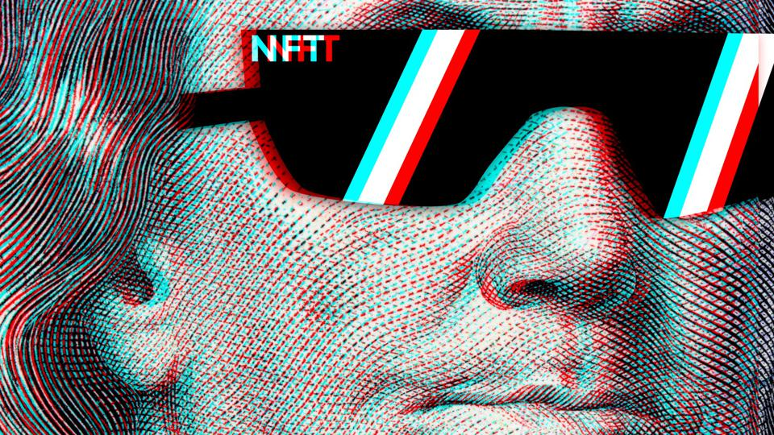
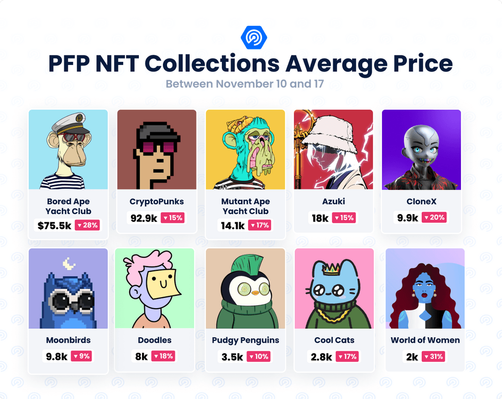
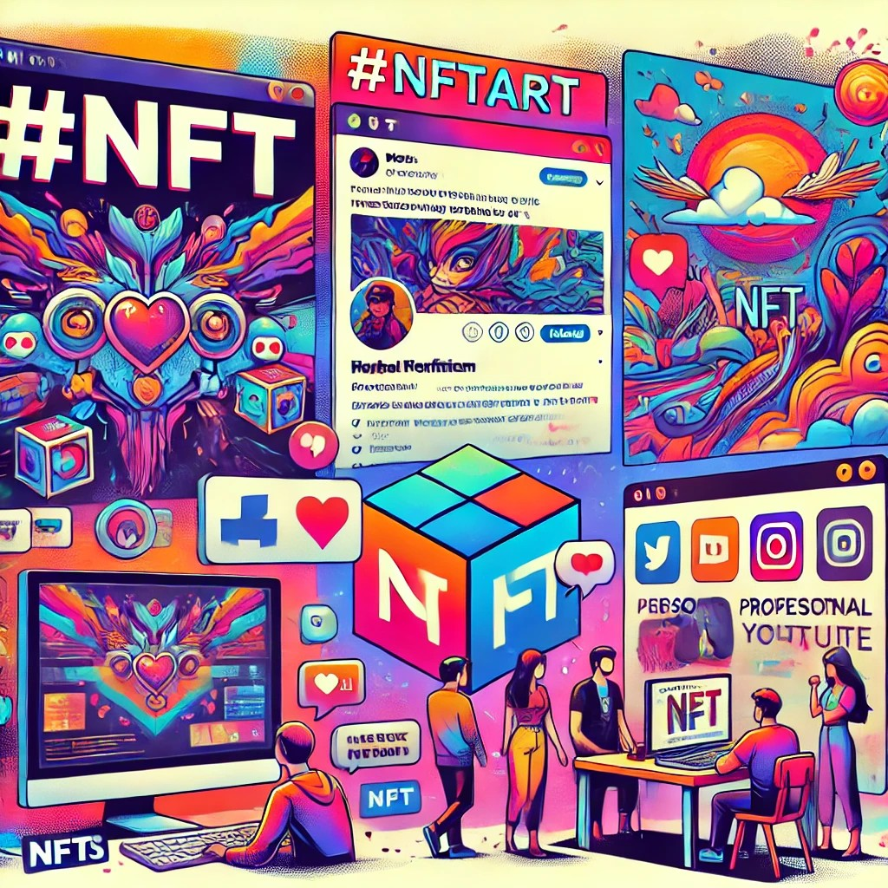

# What is an NFT?

NFT, or **Non-Fungible Token**, is a type of digital asset stored on blockchain technology. Unlike cryptocurrencies such as Bitcoin or Ethereum, which are interchangeable, each NFT has unique characteristics and cannot be replaced by a similar asset. NFTs are particularly used in the fields of digital art, music, video games, and collectibles. Each NFT serves as a digital certificate that provides proof of ownership and authenticity of a digital work or item.

NFTs are created using smart contracts on the blockchain, which permanently record details such as the creator, creation date, and ownership of the asset. This feature has made NFTs a popular tool in the world of art and entertainment. Artists can sell their digital works as NFTs and earn revenue from the sales. One of the key benefits of NFTs is that artists can earn a percentage of future sales (royalties) even after the initial sale, while also retaining their intellectual property rights.

# Creating an NFT

To design an NFT, you first need to create a digital work, such as an image, video, music, or any other digital file. Then, using NFT platforms like Artina or OpenSea, you convert the work into a non-fungible token. In this process, you upload your work to one of these platforms, enter details such as the name, description, and proposed price, and by paying the blockchain network fee, this token is uniquely registered on the blockchain, and you become its owner.

Once the NFT is designed and uploaded, it is transferred to the blockchain via a smart contract. Blockchains like Ethereum or Polygon are used as the main infrastructure for registering NFTs. The smart contract stores information related to the NFT, including ownership, registration date, and its unique features on the blockchain. After being registered on the blockchain, the NFT will exist permanently, and the owner can sell or transfer it to others.

# Earning Revenue

There are various ways to earn revenue through NFTs that people can take advantage of. One of the primary methods is **selling digital works** as NFTs. Artists, photographers, musicians, and even writers can sell their works in the form of NFTs on marketplaces like OpenSea or Artina. A key benefit of this method is that artists receive a percentage from each subsequent sale (royalty) even after the initial sale.

Another way to earn revenue from NFTs is **creating and selling rare or unique items in video games**. Many blockchain-based games allow players to sell their in-game items as NFTs, thereby generating income. Additionally, some users earn revenue by **trading NFTs**. They purchase NFTs at lower prices when the market is favorable and sell them for profit as prices increase. Another method involves **creating NFTs for virtual real estate**, which exists in virtual worlds like Decentraland, allowing users to generate revenue by selling these properties.

Another way to earn is through airdrops from different companies that are distributed for free to their audiences in limited quantities and can be sold later at a good price.

# Promoting an NFT

To promote and advertise your NFT, one of the best ways is to use **Twitter**. Twitter is one of the primary platforms within the blockchain and NFT community, and many artists and collectors use it to showcase their work. To start, you should professionally set up your Twitter profile and continuously share content about NFTs and the process of creating your work. Using **relevant hashtags** such as #NFT, #NFTCommunity, and #NFTArt can help increase the reach of your posts. Additionally, engaging with other artists and collectors, retweeting their works, and participating in related discussions will help you maintain an active presence in the NFT community.

Besides Twitter, there are other ways to promote your NFT. One such way is **using Discord**. Many successful NFT projects have Discord servers that bring together a community of fans and collectors. You can join these servers and promote your work to attract more potential buyers. **Creating a personal website** or **blog** to showcase your NFT collections and the stories behind each piece can also be beneficial. Additionally, you can promote your NFTs through **Instagram** and **YouTube**, building close relationships with your audience by sharing video or visual content.

